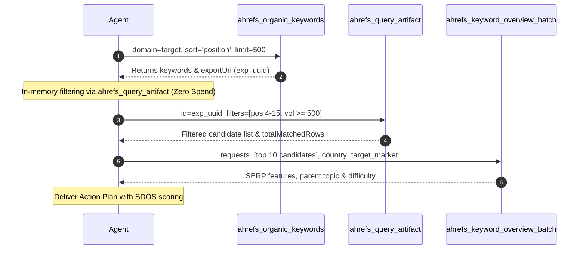

# Workflow: Striking Distance Quick Wins (Positions 4–15)

## 1. Objective & Hypothesis
Keywords ranking in positions 4 through 15 have proven search engine trust and topical relevance, but capture less than 2%–8% CTR. Bumping them into positions 1–3 typically yields a 300%–500% increase in clicks without creating new URLs or redesigning templates.

---

## 2. Execution Pipeline



### Step 1: Capture Ranking Inventory
Call `ahrefs_organic_keywords`:
```json
{
  "domain": "target.com",
  "sort": "position",
  "sortDirection": "asc",
  "limit": 500
}
```
Capture `exportUri` (`exp_<uuid>`).

### Step 2: Query Artifact Locally (Zero Spend)
Call `ahrefs_query_artifact`:
```json
{
  "id": "exp_<uuid>",
  "select": ["keyword", "position", "volume", "url", "traffic", "cpc"],
  "filters": [
    { "field": "position", "operator": "gte", "value": 4 },
    { "field": "position", "operator": "lte", "value": 15 },
    { "field": "volume", "operator": "gte", "value": 500 }
  ],
  "sort": { "field": "traffic", "direction": "desc" },
  "limit": 25
}
```

### Step 3: Batch Enrich Top Candidates
Select the top 10 highest-traffic candidates. Call `ahrefs_keyword_overview_batch`:
```json
{
  "requests": [
    { "keyword": "primary term 1", "country": "us" },
    { "keyword": "primary term 2", "country": "us" }
  ]
}
```

---

## 3. Prioritization & Scoring: SDOS
Calculate the **Striking Distance Opportunity Score (SDOS)**:
$$\text{SDOS} = \frac{\text{Search Volume} \times \text{CPC} \times (20 - \text{SERP Position})}{\text{Keyword Difficulty (KD)} + 1}$$

### Handoff Recommendations
Group candidates by destination URL:
1. **Title Tag Alignment**: Front-load the primary target term.
2. **Intent Matching**: Add missing secondary topics or FAQ schema.
3. **Internal PageRank Inflow**: Direct 2–3 contextual links from top traffic pages (`ahrefs_top_pages`).
